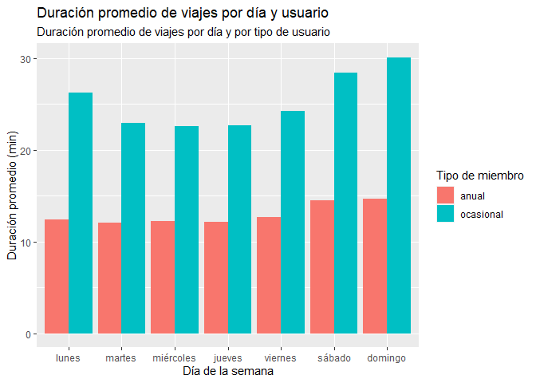
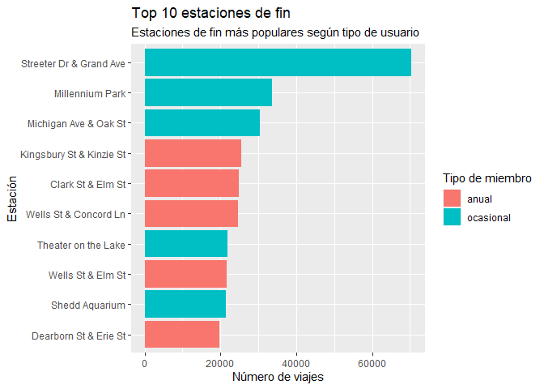

Google Data Analytics Professional Certificate
================
Felipe Avendaño Espinoza
2022-05-14

## Proyecto final

El proyecto consiste en analizar datos de los últimos 12 meses de una
empresa de arriendo de bicicletas de Chicago.

### Librerias

En primer lugar, para poder analizar los datos debemos cargar las
librerías.

``` r
library(tidyverse)
```

    ## ── Attaching packages ─────────────────────────────────────── tidyverse 1.3.1 ──

    ## ✓ ggplot2 3.3.5     ✓ purrr   0.3.4
    ## ✓ tibble  3.1.6     ✓ dplyr   1.0.8
    ## ✓ tidyr   1.2.0     ✓ stringr 1.4.0
    ## ✓ readr   2.1.2     ✓ forcats 0.5.1

    ## ── Conflicts ────────────────────────────────────────── tidyverse_conflicts() ──
    ## x dplyr::filter() masks stats::filter()
    ## x dplyr::lag()    masks stats::lag()

``` r
library(lubridate)
```

    ## 
    ## Attaching package: 'lubridate'

    ## The following objects are masked from 'package:base':
    ## 
    ##     date, intersect, setdiff, union

``` r
library(skimr)
```

### Carga de datos

Se procede a realizar la carga de los doce archivos csv.

``` r
divvy_202105 <- read.csv("202105-divvy-tripdata.csv")
divvy_202106 <- read.csv("202106-divvy-tripdata.csv")
divvy_202107 <- read.csv("202107-divvy-tripdata.csv")
divvy_202108 <- read.csv("202108-divvy-tripdata.csv")
divvy_202109 <- read.csv("202109-divvy-tripdata.csv")
divvy_202110 <- read.csv("202110-divvy-tripdata.csv")
divvy_202111 <- read.csv("202111-divvy-tripdata.csv")
divvy_202112 <- read.csv("202112-divvy-tripdata.csv")
divvy_202201 <- read.csv("202201-divvy-tripdata.csv")
divvy_202202 <- read.csv("202202-divvy-tripdata.csv")
divvy_202203 <- read.csv("202203-divvy-tripdata.csv")
divvy_202204 <- read.csv("202204-divvy-tripdata.csv")
```

Una vez cargados se verifica que las columnas coincidan.

``` r
colnames(divvy_202105)
```

    ##  [1] "ride_id"            "rideable_type"      "started_at"        
    ##  [4] "ended_at"           "start_station_name" "start_station_id"  
    ##  [7] "end_station_name"   "end_station_id"     "start_lat"         
    ## [10] "start_lng"          "end_lat"            "end_lng"           
    ## [13] "member_casual"

``` r
colnames(divvy_202106)
```

    ##  [1] "ride_id"            "rideable_type"      "started_at"        
    ##  [4] "ended_at"           "start_station_name" "start_station_id"  
    ##  [7] "end_station_name"   "end_station_id"     "start_lat"         
    ## [10] "start_lng"          "end_lat"            "end_lng"           
    ## [13] "member_casual"

``` r
colnames(divvy_202107)
colnames(divvy_202108)
colnames(divvy_202109)
colnames(divvy_202110)
colnames(divvy_202111)
colnames(divvy_202112)
colnames(divvy_202201)
colnames(divvy_202202)
colnames(divvy_202203)
colnames(divvy_202204)
```

Al verificar que cuentan con las mismas columnas, se procede a unir
todos los dataframe.

``` r
divvy <- bind_rows(divvy_202105, divvy_202106, divvy_202107, divvy_202108,
                   divvy_202109, divvy_202110, divvy_202111, divvy_202112,
                   divvy_202201, divvy_202202, divvy_202203, divvy_202204)
```

### Análisis y limpieza de datos

Al contar con un único dataframe, se procede a obtener una visión
general de los datos.

``` r
summary(divvy)
```

    ##    ride_id          rideable_type       started_at          ended_at        
    ##  Length:5757551     Length:5757551     Length:5757551     Length:5757551    
    ##  Class :character   Class :character   Class :character   Class :character  
    ##  Mode  :character   Mode  :character   Mode  :character   Mode  :character  
    ##                                                                             
    ##                                                                             
    ##                                                                             
    ##                                                                             
    ##  start_station_name start_station_id   end_station_name   end_station_id    
    ##  Length:5757551     Length:5757551     Length:5757551     Length:5757551    
    ##  Class :character   Class :character   Class :character   Class :character  
    ##  Mode  :character   Mode  :character   Mode  :character   Mode  :character  
    ##                                                                             
    ##                                                                             
    ##                                                                             
    ##                                                                             
    ##    start_lat       start_lng         end_lat         end_lng      
    ##  Min.   :41.64   Min.   :-87.84   Min.   :41.39   Min.   :-88.97  
    ##  1st Qu.:41.88   1st Qu.:-87.66   1st Qu.:41.88   1st Qu.:-87.66  
    ##  Median :41.90   Median :-87.64   Median :41.90   Median :-87.64  
    ##  Mean   :41.90   Mean   :-87.65   Mean   :41.90   Mean   :-87.65  
    ##  3rd Qu.:41.93   3rd Qu.:-87.63   3rd Qu.:41.93   3rd Qu.:-87.63  
    ##  Max.   :45.64   Max.   :-73.80   Max.   :42.17   Max.   :-87.49  
    ##                                   NA's   :4766    NA's   :4766    
    ##  member_casual     
    ##  Length:5757551    
    ##  Class :character  
    ##  Mode  :character  
    ##                    
    ##                    
    ##                    
    ## 

Se detecta en primera instancia datos que no poseen coordenadas, los
cuales son eliminados.

``` r
divvy_clean <- drop_na(divvy, end_lat)
```

A continuación, se obtiene otro resumen de los datos.

``` r
skim_without_charts(divvy_clean)
```

|                                                  |             |
|:-------------------------------------------------|:------------|
| Name                                             | divvy_clean |
| Number of rows                                   | 5752785     |
| Number of columns                                | 13          |
| \_\_\_\_\_\_\_\_\_\_\_\_\_\_\_\_\_\_\_\_\_\_\_   |             |
| Column type frequency:                           |             |
| character                                        | 9           |
| numeric                                          | 4           |
| \_\_\_\_\_\_\_\_\_\_\_\_\_\_\_\_\_\_\_\_\_\_\_\_ |             |
| Group variables                                  | None        |

Data summary

**Variable type: character**

| skim_variable      | n_missing | complete_rate | min | max |  empty | n_unique | whitespace |
|:-------------------|----------:|--------------:|----:|----:|-------:|---------:|-----------:|
| ride_id            |         0 |             1 |  16 |  16 |      0 |  5752785 |          0 |
| rideable_type      |         0 |             1 |  11 |  13 |      0 |        3 |          0 |
| started_at         |         0 |             1 |  19 |  19 |      0 |  4817678 |          0 |
| ended_at           |         0 |             1 |  19 |  19 |      0 |  4812294 |          0 |
| start_station_name |         0 |             1 |   0 |  53 | 790207 |      866 |          0 |
| start_station_id   |         0 |             1 |   0 |  44 | 790204 |      857 |          0 |
| end_station_name   |         0 |             1 |   0 |  53 | 838595 |      865 |          0 |
| end_station_id     |         0 |             1 |   0 |  44 | 838595 |      857 |          0 |
| member_casual      |         0 |             1 |   6 |   6 |      0 |        2 |          0 |

**Variable type: numeric**

| skim_variable | n_missing | complete_rate |   mean |   sd |     p0 |    p25 |    p50 |    p75 |   p100 |
|:--------------|----------:|--------------:|-------:|-----:|-------:|-------:|-------:|-------:|-------:|
| start_lat     |         0 |             1 |  41.90 | 0.05 |  41.64 |  41.88 |  41.90 |  41.93 |  45.64 |
| start_lng     |         0 |             1 | -87.65 | 0.03 | -87.84 | -87.66 | -87.64 | -87.63 | -73.80 |
| end_lat       |         0 |             1 |  41.90 | 0.05 |  41.39 |  41.88 |  41.90 |  41.93 |  42.17 |
| end_lng       |         0 |             1 | -87.65 | 0.03 | -88.97 | -87.66 | -87.64 | -87.63 | -87.49 |

En el cual podemos notar que tenemos tres tipos de bicicletas y dos
tipos de miembros. A continuación, conoceremos los valores únicos de
dichos campos.

``` r
unique(divvy_clean$rideable_type)
```

    ## [1] "electric_bike" "classic_bike"  "docked_bike"

``` r
unique(divvy_clean$member_casual)
```

    ## [1] "casual" "member"

También es posible detectar que existe un número importante de
observaciones sin datos para las estaciones de origen y destino. Se
procede a aplicar distintos filtros para conocer el alcance de la falta
de datos.

En primer lugar, identificamos aquellas observaciones que no posean
nombres ni id en las estaciones de inicio y fin.

``` r
nrow(divvy_clean %>%
  filter(nchar(divvy_clean$start_station_name) == 0,
         nchar(divvy_clean$start_station_id) == 0,
         nchar(divvy_clean$end_station_name) == 0,
         nchar(divvy_clean$end_station_name) == 0
         ))
```

    ## [1] 491763

En segundo lugar, identificaremos aquellas que no posean al menos uno de
esos cuatro datos.

``` r
nrow(divvy_clean %>%
       filter(nchar(divvy_clean$start_station_name) == 0 |
              nchar(divvy_clean$start_station_id) == 0 |
              nchar(divvy_clean$end_station_name) == 0 |
              nchar(divvy_clean$end_station_name) == 0
       ))
```

    ## [1] 1137037

En tercer lugar, aquellas que no posean datos para las estaciones de
inicio.

``` r
nrow(divvy_clean %>%
       filter(nchar(divvy_clean$start_station_name) == 0,
              nchar(divvy_clean$start_station_id) == 0
       ))
```

    ## [1] 790204

Por último, aquellas que no posean datos para las estaciones de fin.

``` r
nrow(divvy_clean %>%
       filter(nchar(divvy_clean$end_station_name) == 0,
              nchar(divvy_clean$end_station_name) == 0
       ))
```

    ## [1] 838595

Es necesario investigar la razón de la falta de datos, ya que representa
aproximadamente un quinto de los datos. De momento se conservarán los
datos, sin embargo al momento de analizar la popularidad de las
estaciones entre los usuarios es importante tener en cuenta las
limitaciones del análisis.

A continuación, se transformaran las variables de fecha y hora al
formato adecuado, además de calcular columnas de apoyo y renombrar las
categorías de usuario.

``` r
divvy_clean <- divvy_clean %>%
  mutate(start_date = ymd_hms(started_at),
         end_date = ymd_hms(ended_at),
         duration_min = as.numeric((end_date - start_date)/60),
         year = year(start_date),
         month = month(start_date, label = TRUE),
         week_day = wday(start_date, label = TRUE, week_start = 1, abbr = FALSE),
         hour = hour(start_date),
         member_casual = recode(member_casual, "member" = "anual",
                                "casual" = "ocasional")
        )
```

Es momento de analizar las duraciones de los viajes, para ello
nuevamente obtendremos un resumen de nuestro dataframe.

``` r
summary(divvy_clean)
```

    ##    ride_id          rideable_type       started_at          ended_at        
    ##  Length:5752785     Length:5752785     Length:5752785     Length:5752785    
    ##  Class :character   Class :character   Class :character   Class :character  
    ##  Mode  :character   Mode  :character   Mode  :character   Mode  :character  
    ##                                                                             
    ##                                                                             
    ##                                                                             
    ##                                                                             
    ##  start_station_name start_station_id   end_station_name   end_station_id    
    ##  Length:5752785     Length:5752785     Length:5752785     Length:5752785    
    ##  Class :character   Class :character   Class :character   Class :character  
    ##  Mode  :character   Mode  :character   Mode  :character   Mode  :character  
    ##                                                                             
    ##                                                                             
    ##                                                                             
    ##                                                                             
    ##    start_lat       start_lng         end_lat         end_lng      
    ##  Min.   :41.64   Min.   :-87.84   Min.   :41.39   Min.   :-88.97  
    ##  1st Qu.:41.88   1st Qu.:-87.66   1st Qu.:41.88   1st Qu.:-87.66  
    ##  Median :41.90   Median :-87.64   Median :41.90   Median :-87.64  
    ##  Mean   :41.90   Mean   :-87.65   Mean   :41.90   Mean   :-87.65  
    ##  3rd Qu.:41.93   3rd Qu.:-87.63   3rd Qu.:41.93   3rd Qu.:-87.63  
    ##  Max.   :45.64   Max.   :-73.80   Max.   :42.17   Max.   :-87.49  
    ##                                                                   
    ##  member_casual        start_date                   
    ##  Length:5752785     Min.   :2021-05-01 00:00:11.0  
    ##  Class :character   1st Qu.:2021-07-07 15:01:51.0  
    ##  Mode  :character   Median :2021-08-31 17:22:00.0  
    ##                     Mean   :2021-09-18 18:27:55.0  
    ##                     3rd Qu.:2021-11-03 20:37:59.0  
    ##                     Max.   :2022-04-30 23:59:54.0  
    ##                                                    
    ##     end_date                       duration_min           year     
    ##  Min.   :2021-05-01 00:03:26.00   Min.   :  -58.03   Min.   :2021  
    ##  1st Qu.:2021-07-07 15:24:33.00   1st Qu.:    6.45   1st Qu.:2021  
    ##  Median :2021-08-31 17:38:24.00   Median :   11.50   Median :2021  
    ##  Mean   :2021-09-18 18:47:55.41   Mean   :   20.01   Mean   :2021  
    ##  3rd Qu.:2021-11-03 20:50:57.00   3rd Qu.:   20.92   3rd Qu.:2021  
    ##  Max.   :2022-05-01 16:16:59.00   Max.   :55944.15   Max.   :2022  
    ##                                                                    
    ##      month              week_day            hour     
    ##  jul    : 821679   lunes    : 734108   Min.   : 0.0  
    ##  ago    : 803646   martes   : 768739   1st Qu.:11.0  
    ##  sep    : 755552   miércoles: 791358   Median :15.0  
    ##  jun    : 728878   jueves   : 783328   Mean   :14.2  
    ##  oct    : 630742   viernes  : 810818   3rd Qu.:18.0  
    ##  may    : 531181   sábado   :1000305   Max.   :23.0  
    ##  (Other):1481107   domingo  : 864129

Aquí podemos observar duraciones negativas y otras muy grandes. Se
eliminaran aquellas observaciones con duraciones negativas y aquellas
que sean mayores a 24 horas.

``` r
divvy_clean <- divvy_clean[divvy_clean$duration > 0,]

divvy_clean <- divvy_clean[divvy_clean$duration < 1440,]
```

Ahora calcularemos el promedio, la mediana, el máximo y el mínimo para
la duración de los viajes, además de la cantidad de viajes por día y por
tipo de miembro.

En primer lugar, se agrupa según el día de la semana.

``` r
divvy_clean %>%
  group_by(week_day) %>%
  summarise(mean = mean(duration_min), median = median(duration_min), 
            max = max(duration_min), min = min(duration_min), n = n())
```

    ## # A tibble: 7 × 6
    ##   week_day   mean median   max    min      n
    ##   <ord>     <dbl>  <dbl> <dbl>  <dbl>  <int>
    ## 1 lunes      17.9   10.8 1431. 0.0167 733904
    ## 2 martes     15.9   10.1 1436. 0.0167 768573
    ## 3 miércoles  16.0   10.3 1437. 0.0167 791143
    ## 4 jueves     16.2   10.4 1435. 0.0167 783133
    ## 5 viernes    17.7   11.1 1435. 0.0167 810579
    ## 6 sábado     22.2   13.8 1440. 0.0167 999945
    ## 7 domingo    23.2   14.1 1439. 0.0167 863679

Se observan claras diferencias según el día de la semana, donde durante
los días sábado y domingo existen una mayor cantidad de viajes y tienen
en promedio una mayor duración. En segundo lugar, se agrupa según el
tipo de usuario.

``` r
divvy_clean %>%
  group_by(member_casual) %>%
  summarise(mean = mean(duration_min), median = median(duration_min), 
            max = max(duration_min), min = min(duration_min), n = n())
```

    ## # A tibble: 2 × 6
    ##   member_casual  mean median   max    min       n
    ##   <chr>         <dbl>  <dbl> <dbl>  <dbl>   <int>
    ## 1 anual          12.9   9.18 1435. 0.0167 3219849
    ## 2 ocasional      26.0  15.5  1440. 0.0167 2531107

Notamos que los miembros ocasionales presentan una menor cantidad de
viajes, sin embargo, sus viajes son de mayor duración. En tercer lugar,
se agrupa tanto según día de la semana como tipo de usuario.

``` r
divvy_clean %>%
  group_by(week_day, member_casual) %>%
  summarise(mean = mean(duration_min), median = median(duration_min), 
            max = max(duration_min), min = min(duration_min), n = n())
```

    ## `summarise()` has grouped output by 'week_day'. You can override using the
    ## `.groups` argument.

    ## # A tibble: 14 × 7
    ## # Groups:   week_day [7]
    ##    week_day  member_casual  mean median   max    min      n
    ##    <ord>     <chr>         <dbl>  <dbl> <dbl>  <dbl>  <int>
    ##  1 lunes     anual          12.4   8.77 1380  0.0167 445471
    ##  2 lunes     ocasional      26.2  15.4  1431. 0.0167 288433
    ##  3 martes    anual          12.0   8.67 1406. 0.0167 498500
    ##  4 martes    ocasional      22.9  13.6  1436. 0.0167 270073
    ##  5 miércoles anual          12.3   8.88 1415. 0.0167 506773
    ##  6 miércoles ocasional      22.6  13.7  1437. 0.0167 284370
    ##  7 jueves    anual          12.2   8.82 1421. 0.0167 485663
    ##  8 jueves    ocasional      22.7  13.6  1435. 0.0167 297470
    ##  9 viernes   anual          12.6   9.03 1435. 0.0167 453080
    ## 10 viernes   ocasional      24.2  14.6  1433. 0.0167 357499
    ## 11 sábado    anual          14.5  10.4  1434. 0.0167 442539
    ## 12 sábado    ocasional      28.4  17.4  1440. 0.0167 557406
    ## 13 domingo   anual          14.7  10.4  1377. 0.0167 387823
    ## 14 domingo   ocasional      30.1  18.2  1439. 0.0167 475856

Es posible observar el efecto tanto del día de la semana como del tipo
de miembro, se mantiene una diferencia significativa en las duraciones
de los viajes y se nota un peak para los miembros anuales durante el día
miércoles, mientras que el día con la menor cantidad de viajes para este
grupo corresponde al domingo.

En esta sección, se presentará el top 10 de las estaciones, tanto para
iniciar un viaje como para su fin.

En primer lugar, observamos las estaciones de inicio más populares, es
decir, con mayor cantidad de viajes iniciados.

``` r
estaciones_inicio <- divvy_clean %>%
  filter(start_station_name != "") %>%
  group_by(member_casual, start_station_name) %>%
  summarise(n_viajes = n()) %>%
  arrange(desc(n_viajes))

head(estaciones_inicio)
```

    ## # A tibble: 6 × 3
    ## # Groups:   member_casual [2]
    ##   member_casual start_station_name       n_viajes
    ##   <chr>         <chr>                       <int>
    ## 1 ocasional     Streeter Dr & Grand Ave     67927
    ## 2 ocasional     Millennium Park             32525
    ## 3 ocasional     Michigan Ave & Oak St       29007
    ## 4 anual         Kingsbury St & Kinzie St    25633
    ## 5 anual         Clark St & Elm St           24771
    ## 6 anual         Wells St & Concord Ln       24006

A continuación, se observan las estaciones de fin más populares.

``` r
estaciones_fin <- divvy_clean %>%
  filter(end_station_name != "") %>%
  group_by(member_casual, end_station_name) %>%
  summarise(n_viajes = n()) %>%
  arrange(desc(n_viajes))

head(estaciones_fin)
```

    ## # A tibble: 6 × 3
    ## # Groups:   member_casual [2]
    ##   member_casual end_station_name         n_viajes
    ##   <chr>         <chr>                       <int>
    ## 1 ocasional     Streeter Dr & Grand Ave     70452
    ## 2 ocasional     Millennium Park             33549
    ## 3 ocasional     Michigan Ave & Oak St       30320
    ## 4 anual         Kingsbury St & Kinzie St    25486
    ## 5 anual         Clark St & Elm St           24776
    ## 6 anual         Wells St & Concord Ln       24622

### Gráficos

En esta sección se observaran distintos gráficos que nos permitirán
comparar ambos tipos de usuario de acuerdo a distintos criterios.

En primer lugar observaremos gráficos con datos agrupados según el mes
en el cual se realizaba el viaje.

El primer gráfico consiste en la cantidad de viajes realizados en cada
mes según el tipo de usuario.

``` r
ggplot(data = divvy_clean) + 
  geom_bar(mapping = aes(x = month, fill = member_casual),
           position = "dodge" ) +
  scale_y_continuous(labels = scales::comma) +
  labs(title = "Viajes por mes y usuario",
       subtitle = "Número de viajes por mes y por tipo de usuario",
       x = "Mes",
       y = "Número de viajes",
       fill="Tipo de miembro"
       )
```

<!-- -->

Se observa que tanto para los miembros anuales como los ocasionales
existe una clara disminución en la cantidad de viajes realizados durante
los meses de enero y febrero, los cuales a partir de marzo van en
aumento hasta alcanzar un máximo en los meses de julio y agosto.

El segundo gráfico corresponde a la duración promedio de los viajes
realizados según tipo de usuario.

``` r
ggplot(data = divvy_clean) + 
  geom_bar(mapping = aes(x = month, y = duration_min, fill = member_casual),
           stat = "summary", fun = "mean", position = "dodge" ) +
  scale_y_continuous(labels = scales::comma) +
  labs(title = "Duración promedio de Viajes por mes y usuario",
       subtitle = "Duración promedio de viajes por mes y por tipo de usuario",
       x = "Mes",
       y = "Duración promedio del viaje (min)",
       fill="Tipo de miembro"
  )
```

<!-- -->

En el caso de los miembros anuales la duración de sus viajes tiende a
permanecer acotada en un rango de 10 a 15 minutos, sufriendo leves
variaciones a lo largo de los meses. Por otro lado, para los miembros
ocasionales la duración de los viajes presenta mayores cambios. El
mínimo se da en enero, mientras que el máximo se alcanza en mayo.

El tercer gráfico corresponde al tiempo total de los viajes realizados
dentro de un mes según el tipo de usuario.

``` r
ggplot(data = divvy_clean) + 
  geom_bar(mapping = aes(x = month, y = duration_min, fill = member_casual),
           stat = "summary", fun = "sum",position = "dodge" ) +
  scale_y_continuous(labels = scales::comma) +
  labs(title = "Duración total de Viajes por mes y usuario",
       subtitle = "Duración total de viajes por mes y por tipo de usuario",
       x = "Mes",
       y = "Duración total de viaje (min)",
       fill="Tipo de miembro"
  )
```

<!-- -->

Es evidente que para ambos tipos de clientes los viajes se concentran en
los meses de verano, alcanzando los mayores valores entre mayo a
octubre.

En segundo lugar, analizaremos gráficos con datos agrupados según el día
de la semana.

El primer gráfico consiste en la cantidad de viajes realizados en un día
de la semana según el tipo de usuario.

``` r
ggplot(data = divvy_clean) + 
  geom_bar(mapping = aes(x = week_day, fill = member_casual),
           position = "dodge" ) +
  scale_y_continuous(labels = scales::comma) +
  labs(title = "Viajes por día y usuario",
      subtitle = "Número de viajes por día y por tipo de usuario",
      x = "Día de la semana",
      y = "Número de viajes",
      fill="Tipo de miembro"
      )
```

<!-- -->

Se nota que existe una clara diferencia entre los tipos de miembros, los
ocasionales aumentan la cantidad de viajes durante el fin de semana
mientras que los miembros anuales tienden a aumentar la cantidad de
viajes en la mitad de la semana, presentando leves disminuciones durante
el fin de semana.

El segundo gráfico corresponde a la duración promedio de los viajes
realizados en un día de la semana según el tipo de usuario.

``` r
ggplot(data = divvy_clean) + 
  geom_bar(mapping = aes(x = week_day, y = duration_min, fill = member_casual),
           stat = "summary", fun = "mean", position = "dodge") +
  scale_y_continuous(labels = scales::comma) +
  labs(title = "Duración promedio de viajes por día y usuario",
       subtitle = "Duración promedio de viajes por día y por tipo de usuario",
       x = "Día de la semana",
       y = "Duración promedio (min)",
       fill="Tipo de miembro"
  )
```

<!-- -->

La duración promedio de los viajes para los miembros anuales se mantiene
relativamente constante, independiente del día de la semana, mientras
que para los miembros ocasionales la duración presenta sus mayores
valores los días sábado, domingo y lunes.

El tercer gráfico corresponde a la duración total de los viajes
realizados en un día de la semana según el tipo de usuario.

``` r
ggplot(data = divvy_clean) + 
  geom_bar(mapping = aes(x = week_day, y = duration_min, fill = member_casual),
           stat = "summary", fun = "sum", position = "dodge") +
  scale_y_continuous(labels = scales::comma) +
  labs(title = "Duración total de Viajes por día y usuario",
       subtitle = "Duración total de viajes por día y por tipo de usuario",
       x = "Día de la semana",
       y = "Duración total de viajes (min)",
       fill="Tipo de miembro"
  )
```

<!-- -->

Se observa un claro aumento en la duración total de los viajes durante
el fin de semana para los miembros ocasionales. Durante la semana la
duración total permanece relativamente constante para ambos tipos de
miembros.

En tercer lugar, analizaremos gráficos con datos agrupados según la hora
del día.

El primer gráfico corresponde a la cantidad de viajes realizados en una
hora en particular según el tipo de usuario.

``` r
ggplot(data = divvy_clean) + 
  geom_bar(mapping = aes(x = hour, fill = member_casual),
           position = "dodge" ) +
  scale_y_continuous(labels = scales::comma) +
  labs(title = "Viajes por hora y usuario",
       subtitle = "Número de viajes por hora de inicio y por tipo de usuario",
       x = "Hora del día",
       y = "Número de viajes",
       fill="Tipo de miembro"
  )
```

<!-- -->

Para los miembros ocasionales notamos un mínimo a las 04:00 horas y un
máximo a las 17:00 horas, presentando transiciones suaves entre ambos
puntos. Por otro lado, para los miembros anuales se detectan los mismos
mínimos y máximos, sin embargo, la transición entre ambos puntos
presenta un significativo aumento a las 07:00 y 08:00 horas.

El segundo gráfico corresponde a la duración promedio de los viajes
realizados en una hora en particular según el tipo de usuario.

``` r
ggplot(data = divvy_clean) + 
  geom_bar(mapping = aes(x = hour, y = duration_min, fill = member_casual),
           stat = "summary", fun = "mean", position = "dodge" ) +
  scale_y_continuous(labels = scales::comma) +
  labs(title = "Duración promedio de viajes por hora y usuario",
       subtitle = "Duración promedio de viajes por hora y por tipo de usuario",
       x = "Hora del día",
       y = "Duración promedio (min)",
       fill="Tipo de miembro"
       )
```

<!-- -->

Notamos que los miembros anuales presentan una duración promedio
relativamente constante a lo largo del día, mientras que los miembros
ocasionales presentan una disminución entre las 05:00 a 08:00 horas y un
aumento entre las 10:00 a 15:00 horas.

El tercer gráfico corresponde a la duración total de los viajes
realizados en una hora en particular según el tipo de usuario.

``` r
ggplot(data = divvy_clean) + 
  geom_bar(mapping = aes(x = hour, y = duration_min, fill = member_casual),
           stat = "summary", fun = "sum", position = "dodge" ) +
  scale_y_continuous(labels = scales::comma) +
  labs(title = "Duración total de viajes por hora y usuario",
       subtitle = "Duración total de viajes por hora y por tipo de usuario",
       x = "Hora del día",
       y = "Duración total (min)",
       fill="Tipo de miembro"
  )
```

<!-- -->

Observamos que los miembros anuales solo superan a los ocasionales en la
duración total de los viajes entre las 05:00 a las 08:00 horas. En todos
los otros horarios son los miembros ocasionales quienes poseen una mayor
duración total de sus viajes.

En cuarto lugar, analizaremos un gráfico con datos agrupados según la
duración del viaje.

``` r
ggplot(data = divvy_clean) + 
  geom_bar(mapping = aes(x = duration_min, fill = member_casual),
           position = "dodge") +
  coord_cartesian(xlim = c(0, 50)) +
  scale_y_continuous(labels = scales::comma) +
  labs(title = "Viajes según su duración",
       subtitle = "Cantidad de viajes por su duración y tipo de usuario",
       x = "Duración (min)",
       y = "Número de viajes",
       fill="Tipo de miembro"
       )
```

<!-- -->

En este gráfico, podemos entender que los miembros anuales realizan una
mayor cantidad de viajes con una duración menor, y a medida que aumenta
la duración del viaje disminuye la cantidad de viajes realizados por
este tipo de miembro. Por otro lado, los miembros ocasionales si bien de
igual forma disminuyen la cantidad de viajes realizados según aumenta su
duración, mantienen un nivel mayor.

En último lugar, se analizarán gráficos con datos agrupados según las
estaciones de inicio y fin.

El primer gráfico corresponde a las 10 estaciones de inicio más
populares.

``` r
ggplot(data = estaciones_inicio[1:10, ]) + 
  geom_col(mapping = aes(x = reorder(start_station_name, n_viajes), 
                         y = n_viajes, fill = member_casual),
           position = "dodge") +
  coord_flip() +
  labs(title = "Top 10 estaciones de inicio",
       subtitle = "Estaciones de inicio más populares según tipo de usuario",
       x = "Estación",
       y = "Número de viajes",
       fill="Tipo de miembro"
       )
```

<!-- -->

El segundo gráfico corresponde a las 10 estaciones de fin más populares.

``` r
ggplot(data = estaciones_fin[1:10, ]) + 
  geom_col(mapping = aes(x = reorder(end_station_name, n_viajes),
                         y = n_viajes, fill = member_casual),
           position = "dodge") +
  coord_flip() +
  labs(title = "Top 10 estaciones de fin",
       subtitle = "Estaciones de fin más populares según tipo de usuario",
       x = "Estación",
       y = "Número de viajes",
       fill="Tipo de miembro"
       )
```

<!-- -->

### Conclusiones

Debido a que los miembros ocasionales presentan patrones de uso
distintos a los de un miembro anual recomendamos tomar las siguientes
medidas:

-   Implementar la campaña durante el verano
-   Enfocar la publicidad en las estaciones de mayor transito (Streeter
    Dr & Grand Ave, Millenium Park)
-   Concentrar los esfuerzos de la campaña de marketing es las horas con
    mayor transito (11:00 a 18:00)
-   Dar prioridad a los fines de semana e instalar puestos para
    inscribirse
-   Ofrecer beneficios o descuentos para viajes de mayor duración
